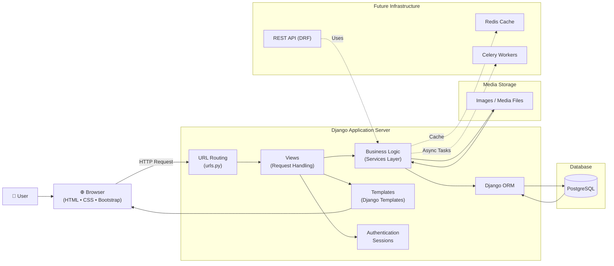

# 🏗️ Social Network Architecture

This document describes the architecture and design decisions of the Social Network project.

---

# High-Level Architecture

```mermaid
flowchart LR

    %% =========================
    %% Client Layer
    %% =========================
    User["👤 User"]
    Browser["🌐 Browser<br/>(HTML • CSS • Bootstrap)"]

    User --> Browser

    %% =========================
    %% Django Application
    %% =========================
    subgraph Django["Django Application Server"]

        URL["URL Routing<br/>(urls.py)"]

        View["Views<br/>(Request Handling)"]

        Service["Business Logic<br/>(Services Layer)"]

        ORM["Django ORM"]

        Template["Templates<br/>(Django Templates)"]

        Auth["Authentication<br/>Sessions"]

    end

    Browser -->|HTTP Request| URL

    URL --> View

    View --> Auth

    View --> Service

    Service --> ORM

    Template --> Browser

    View --> Template

    %% =========================
    %% Database
    %% =========================

    subgraph Database["Database"]

        PostgreSQL[("PostgreSQL")]

    end

    ORM --> PostgreSQL
    PostgreSQL --> ORM

    %% =========================
    %% Storage
    %% =========================

    subgraph Storage["Media Storage"]

        Media["Images / Media Files"]

    end

    Service --> Media
    Media --> Service

    %% =========================
    %% Future Services
    %% =========================

    subgraph Future["Future Infrastructure"]

        Redis["Redis Cache"]

        Celery["Celery Workers"]

        API["REST API (DRF)"]

    end

    Service -. Cache .-> Redis

    Service -. Async Tasks .-> Celery

    API -. Uses .-> Service
```